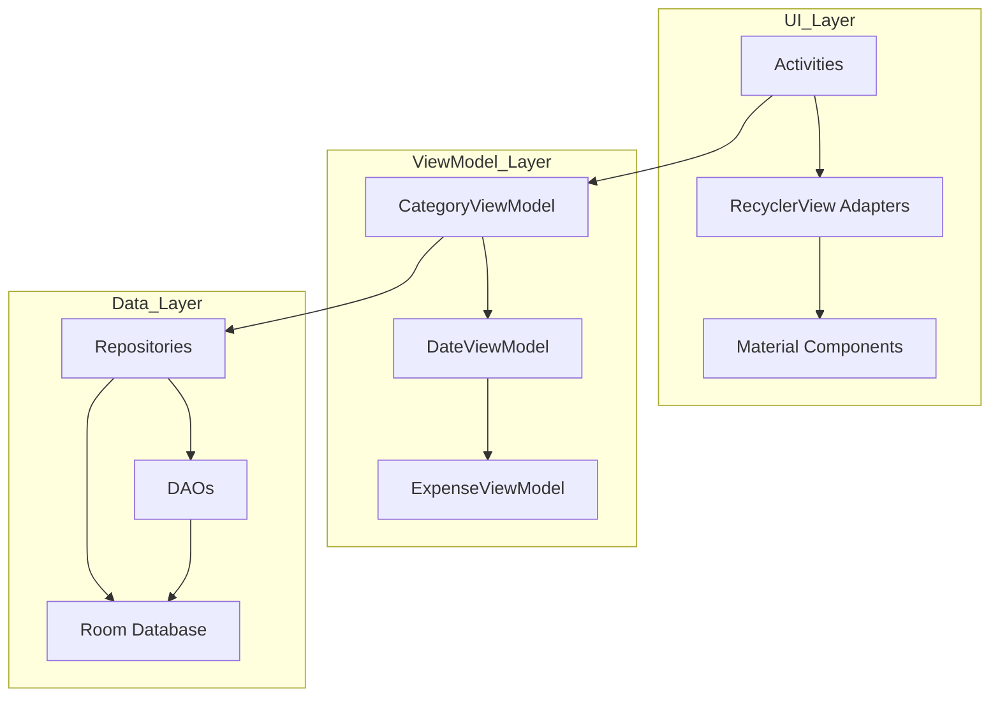

# Usmentz - Personal Moments Tracker

A mobile application for organizing and tracking your special moments and experiences. Built with native **Android (Java)** using modern architecture patterns.


---

## Overview

Usmentz is a personal moments management application that helps users organize their special dates and experiences. The app provides category-based organization, expense tracking for each moment, rating and review systems, and automatic favorites collection.

---

## Features

* Category management with custom icons and colors
* Moment/date location tracking with address and descriptions
* Expense tracking per moment with total calculations
* 5-star rating system with text reviews
* Photo attachments for moments
* Automatic favorites collection (4+ stars)
* Calendar-based moment viewing
* Swipe-to-delete with undo functionality
* Drag-and-drop moment reordering
* Bottom navigation with 4 main sections

---

## System Architecture



---

## Technology Stack

| Layer | Technology |
|-------|------------|
| Language | Java 17 |
| Platform | Android (SDK 34) |
| Architecture | MVVM |
| Database | Room Persistence Library |
| Image Loading | Glide |
| UI Framework | Material Design Components |
| State Management | LiveData |
| Navigation | ViewPager2, TabLayout |

---

## Project Structure

```
usmentz/
├── app/src/main/java/com/example/usmentz/
│   ├── Activities/
│   │   ├── MainActivity.java
│   │   ├── DetailActivity.java
│   │   ├── CalendarActivity.java
│   │   ├── FavoritesActivity.java
│   │   └── ReviewsActivity.java
│   ├── adapter/          # RecyclerView Adapters
│   ├── category/         # Category models & dialogs
│   ├── date/            # DateLocation model
│   ├── fina/            # Expense model
│   ├── database/       # Room database & converters
│   ├── dao/            # Data Access Objects
│   ├── repo/           # Repository pattern
│   └── viewmodel/      # MVVM ViewModels
└── app/src/main/res/   # Resources & layouts
```

---

## Database Schema

### Tables

**categories**
| Column | Type | Description |
|--------|------|-------------|
| id | INTEGER | Primary key, auto-generated |
| name | TEXT | Category name |
| iconName | TEXT | Icon identifier |
| color | INTEGER | Color value |
| itemCount | INTEGER | Number of moments |

**date_locations**
| Column | Type | Description |
|--------|------|-------------|
| id | INTEGER | Primary key, auto-generated |
| name | TEXT | Location name |
| address | TEXT | Location address |
| description | TEXT | Description text |
| date | INTEGER | Timestamp |
| rating | REAL | 0-5 star rating |
| review | TEXT | Review text |
| photoPath | TEXT | Photo URI |
| categoryId | INTEGER | Foreign key |

**expenses**
| Column | Type | Description |
|--------|------|-------------|
| id | INTEGER | Primary key, auto-generated |
| description | TEXT | Expense description |
| amount | REAL | Expense amount |
| momentId | INTEGER | Foreign key |

---

## Setup

### Prerequisites

* Android Studio Arctic Fox or later
* JDK 17 or later
* Android SDK 34

### Build Steps

```bash
# Clone the repository
git clone <repository-url>

# Open in Android Studio
# Wait for Gradle sync to complete

# Build the project
./gradlew build

# Run on device or emulator
```

### Dependencies

The following libraries are used (defined in build.gradle):

* AndroidX AppCompat 1.6.1
* Material Components 1.11.0
* ConstraintLayout 2.1.4
* RecyclerView 1.3.2
* CardView 1.0.0
* Glide 4.16.0
* Room 2.6.1
* Lifecycle ViewModel 2.7.0
* Lifecycle LiveData 2.7.0

---

## API Reference

| Method | Description |
|--------|-------------|
| CategoryViewModel | Manages category CRUD operations |
| DateViewModel | Handles moment/moment data operations |
| ExpenseViewModel | Controls expense tracking |

### Data Flow

```java
// Adding a new moment
Category category = new Category("First Dates", "heart", 0xFF9B5CFF);
categoryViewModel.insert(category);

DateLocation moment = new DateLocation("Restaurant Name", "123 Main St", "Great dinner", new Date());
moment.setCategoryId(category.getId());
dateViewModel.insert(moment);

// Adding expense
Expense expense = new Expense("Dinner", 150.00, moment.getId());
expenseViewModel.insert(expense);
```

---

## Navigation Flow

```
MainActivity (Categories)
    |
    +-- Click Category --> Moments List
    |       +-- Click Moment --> DetailActivity
    |           +-- Tab 1: Details
    |           +-- Tab 2: Expenses
    |           +-- Tab 3: Review
    |
    +-- Bottom Nav
        +-- Categories (Main)
        +-- Favorites (4+ stars)
        +-- Calendar (by date)
        +-- Reviews (all reviews)
```

---

## Acknowledgments

* Android Developers documentation
* Room Persistence Library
* Material Design Components
* Glide Image Library

---

<div align="center">

**Usmentz** - Track Your Special Moments

</div>